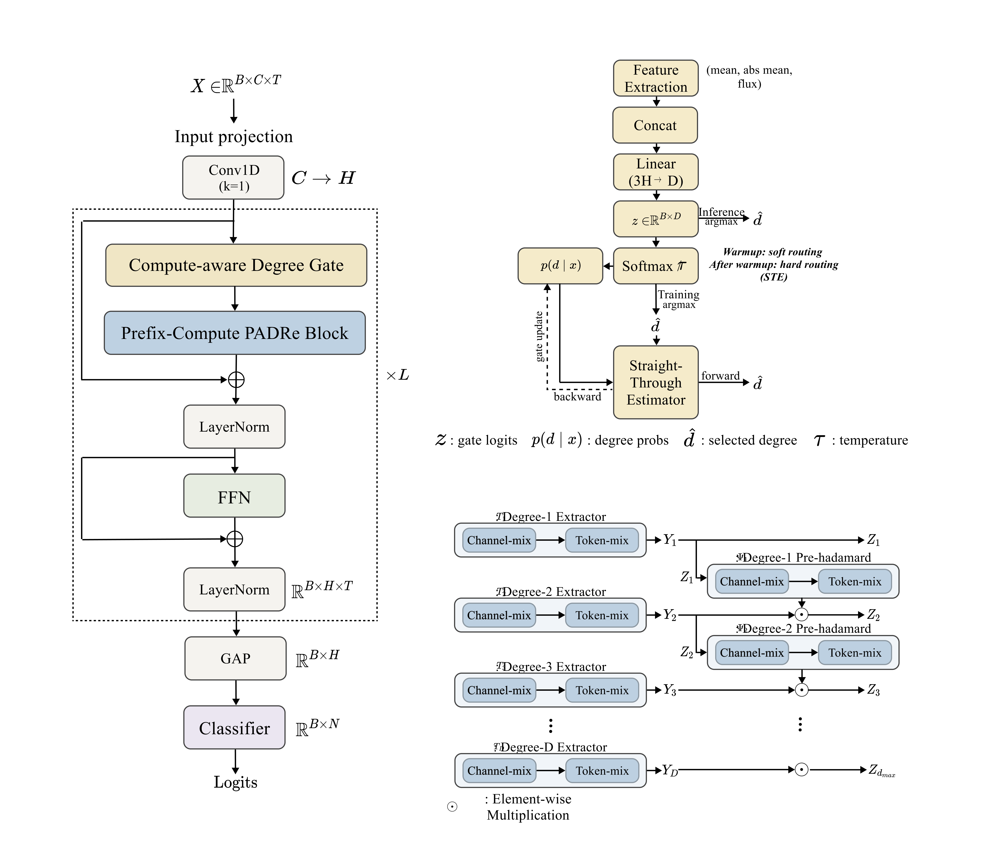

# Compute-Aware Shared-Block Adaptive Execution for IMU-Based Human Activity Recognition

<p align="center">
  
</p>

This repository implements the methodology proposed in the paper "Compute-Aware Shared-Block Adaptive Execution for IMU-Based Human Activity Recognition".


## Paper Overview
**Abstract**: Sensor-based human activity recognition (HAR) on
edge platforms requires effective strategies to reduce inferencetime computation while preserving recognition quality. However,
existing approaches, such as early exiting or explicit multi-branch
routing, often introduce architectural complexity or additional
decision overhead, which can limit their practical efficiency on
resource-constrained devices. To address this issue, we propose
a compute-aware Polynomial Attention Drop-in Replacement
(PADRe) architecture that adaptively regulates per-sample executed computation within a single shared backbone through
prefix-based execution of polynomial transformations. Rather
than relying on early-exit inference or explicit multi-branch
routing, the proposed method preserves a unified sequential
execution path and instead controls how much computation is
executed inside each block according to the input. To enable
this, we introduce a lightweight degree gate that estimates inputdependent computation demand from a global feature descriptor.
During training, the model first uses soft routing for stable
optimization and then transitions to hard prefix execution aligned
with inference-time computation. Based on the selected degree, each prefix-compute PADRe block progressively constructs
higher-order representations by reusing intermediate outputs,
thereby avoiding unnecessary higher-degree computation within
the shared block. Experiments on four HAR benchmarks, UCIHAR, WISDM, PAMAP2, and MHEALTH, show that the proposed method maintains competitive recognition performance
while reducing average executed computation relative to a fixed
maximum-degree baseline, yielding average reductions of approximately 19.6% in floating-point operations (FLOPs) and 28.5% in
inference latency. Comparisons with fixed-degree variants under
matched computational budgets further support the practical
relevance of the proposed adaptive execution mechanism. In addition, corruption analyses indicate relatively stable behavior under
moderate noise conditions. Overall, these results demonstrate
that the proposed framework provides an effective performance–
computation trade-off for wearable HAR by enabling inputadaptive compute control within a shared sequential backbone.


## Dataset
- **UCI-HAR** dataset is available at _https://archive.ics.uci.edu/dataset/240/human+activity+recognition+using+smartphones_
- **PAMAP2** dataset is available at _https://archive.ics.uci.edu/dataset/231/pamap2+physical+activity+monitoring_
- **MHEALTH** dataset is available at _https://archive.ics.uci.edu/dataset/319/mhealth+dataset_
- **WISDM** dataset is available at _https://www.cis.fordham.edu/wisdm/dataset.php_

## Requirements
```
torch==2.5.0+cu126
numpy==2.0.2
pandas==2.2.2
scikit-learn==1.6.1
matplotlib==3.10.0
seaborn==0.13.2
fvcore==0.1.5.post20221221
```
To install all required packages:
```
pip install -r requirements.txt
```

## Codebase Overview
- `model.py` - Implementation of the proposed **compute-aware Polynomial Attention Drop-in Replacement (PADRe)** architecture.
The implementation uses PyTorch, Numpy, pandas, scikit-learn, matplotlib, seaborn, and fvcore (for FLOPs analysis).

## Citing this Repository

If you use this code in your research, please cite:

```
@article{Compute-Aware Shared-Block Adaptive Execution for IMU-Based Human Activity Recognition,
  title = {Compute-Aware Shared-Block Adaptive Execution for IMU-Based Human Activity Recognition},
  author={JunYoung Park and Myung-Kyu Yi}
  journal={},
  volume={},
  Issue={},
  pages={},
  year={}
  publisher={}
}
```

## Contact

For questions or issues, please contact:
- JunYoung Park : park91802@gmail.com

## License

This project is licensed under the MIT License - see the [LICENSE](LICENSE) file for details.
